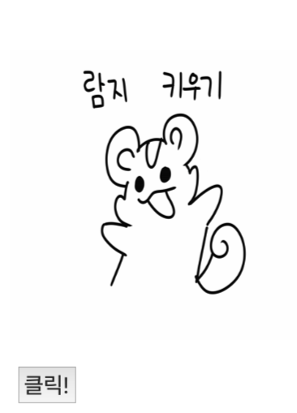
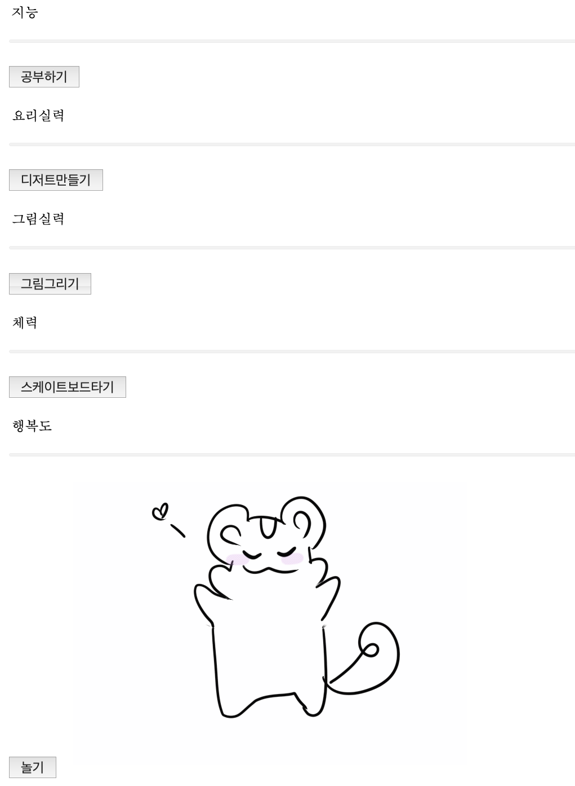
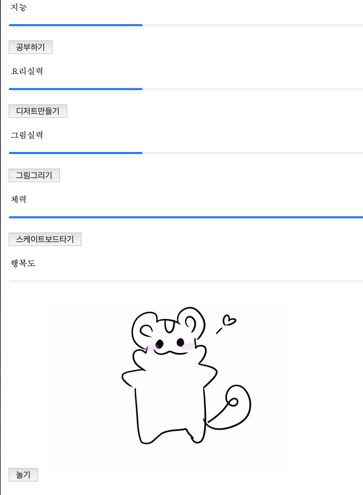
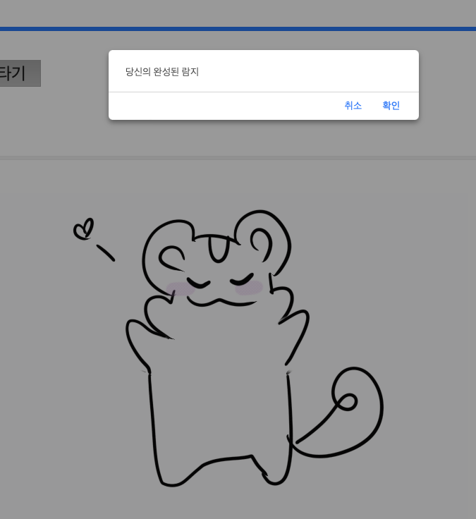
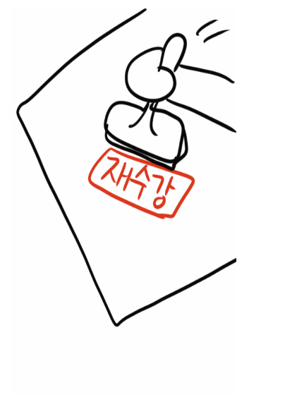
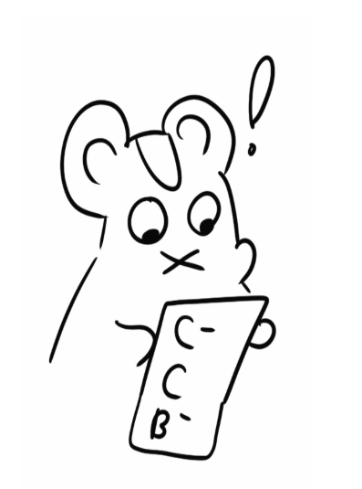

## 첫 번쩨 프로그램 발굴

"람쥐 키우기" 라는 프로그램을 만들었었다.

버튼을 눌러 게이지바를 채울 수 있고, 어느 한 분야의 게이지바가 다 차면 결말 gif가 나온다.

공부하기를 다 채우면 대학원 납치 결말이고

다른 항목을 다 채우면 재수강 엔딩이다.

### link

실행 링크 : https://game1.goldchae.repl.co

블로그 링크 : https://junggoldchae-coding.tistory.com/entry/HTMLCSSJS람지-키우기
